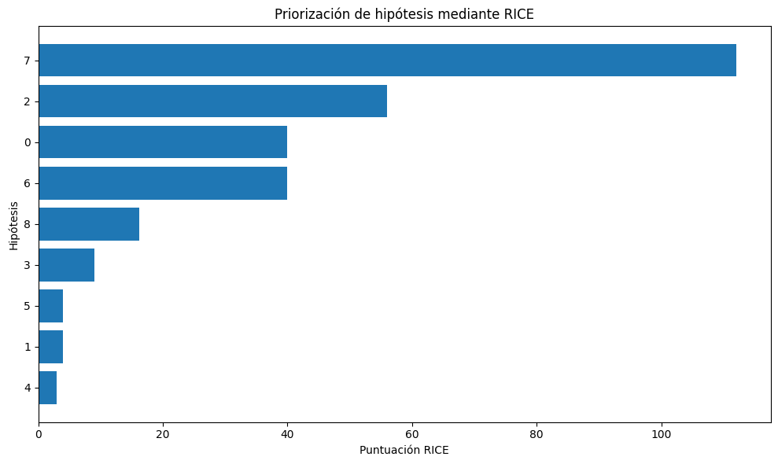
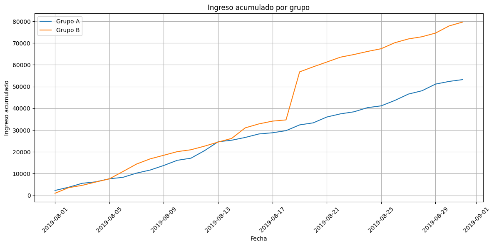
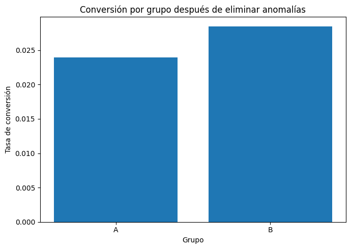

[](https://colab.research.google.com/github/andermartinezalberdi/ecommerce-ab-testing-analysis/blob/main/notebook/analisis_ab_ecommerce.ipynb)

# E-commerce A/B Testing & Revenue Analysis

Análisis de un experimento A/B para una tienda online, orientado a priorizar oportunidades de crecimiento y determinar qué variante genera mejores resultados de negocio.

## Objetivo

El proyecto busca responder dos preguntas principales:

1. ¿Qué hipótesis de crecimiento debería priorizar el equipo de marketing?
2. ¿La variante B del experimento A/B genera una mejora significativa frente al grupo A?

Para responderlas se utilizaron los frameworks **ICE y RICE**, análisis exploratorio de datos, detección de valores atípicos y pruebas estadísticas no paramétricas.

---

## Resumen ejecutivo

El análisis combina priorización de iniciativas de marketing con la evaluación estadística de un experimento A/B.

### Resultados principales

- La priorización mediante **RICE** situó la hipótesis 7 como la iniciativa con mayor prioridad.
- Se identificaron **58 usuarios presentes en ambos grupos**, que fueron excluidos para evitar contaminación entre las variantes del experimento.
- Después de eliminar valores atípicos, el grupo B obtuvo una **conversión aproximadamente 18.9% superior** al grupo A.
- La diferencia de conversión fue estadísticamente significativa (`p-value = 0.00702`).
- No se encontraron diferencias estadísticamente significativas en el tamaño promedio de pedido (`p-value = 0.82203`).
- Se detectó un pedido excepcional de **19,920.4** que estaba distorsionando inicialmente los resultados del grupo B.

## Decisión de negocio

**Se recomienda detener el experimento y considerar al grupo B como la variante ganadora.**

La variante B incrementa significativamente la conversión sin evidencia de una diferencia significativa en el tamaño promedio de pedido.

En términos de negocio, la principal ventaja de B se encuentra en su capacidad para convertir una mayor proporción de visitantes en compradores.

➡️ [Ver análisis completo en el notebook](notebook/analisis_ab_ecommerce.ipynb)

---

## Datos

El análisis utiliza tres datasets:

- `hypotheses_us.csv`: hipótesis de crecimiento y métricas necesarias para calcular ICE y RICE.
- `orders_us.csv`: transacciones, usuarios, fechas, ingresos y grupo experimental.
- `visits_us.csv`: visitas diarias registradas para los grupos A y B.

Los datasets fueron proporcionados originalmente como parte de un ejercicio de formación del programa de **Data Analyst de TripleTen**.

Los archivos originales no se redistribuyen públicamente en este repositorio.

Más información sobre los archivos esperados en [`data/README.md`](data/README.md).

---

## Metodología

El proyecto se desarrolló en las siguientes etapas:

1. Revisión inicial de los datasets.
2. Preparación y estandarización de los datos.
3. Identificación de usuarios presentes en ambos grupos del experimento.
4. Exclusión de usuarios que podían contaminar la comparación A/B.
5. Priorización de hipótesis mediante **ICE**.
6. Priorización de hipótesis mediante **RICE**.
7. Comparación de ambos frameworks.
8. Análisis del ingreso acumulado.
9. Análisis del tamaño promedio de pedido.
10. Análisis de la tasa de conversión.
11. Identificación de valores atípicos mediante percentiles.
12. Comparación estadística de los grupos mediante la prueba de **Mann–Whitney U**.
13. Repetición del análisis después de eliminar anomalías.
14. Formulación de una recomendación de negocio basada en los resultados.

---

## Herramientas

- **Python**
- **pandas**
- **NumPy**
- **Matplotlib**
- **SciPy**
- **Jupyter Notebook**
- **Google Colab**
- **GitHub**

---

## Visualizaciones clave

### 1. Priorización de hipótesis con RICE

La incorporación del alcance de usuarios modifica de forma importante la priorización obtenida mediante ICE.

La hipótesis 7 se convierte en la principal candidata al combinar un alcance elevado con buenos niveles de impacto y confianza.



---

### 2. Ingreso acumulado por grupo

El grupo B finaliza el experimento con un ingreso acumulado superior al grupo A.

Sin embargo, durante el periodo se observa un incremento abrupto asociado a pedidos de valor excepcionalmente alto, lo que demuestra la importancia de revisar los valores atípicos antes de interpretar los resultados.



---

### 3. Conversión después de eliminar anomalías

Después de excluir los usuarios con comportamiento anómalo, el grupo B mantiene una conversión aproximadamente **18.9% superior** a la del grupo A.

La diferencia continúa siendo estadísticamente significativa (`p-value = 0.00702`).



---

## Resultados estadísticos

| Métrica | Datos | p-value | Diferencia B vs A | Resultado |
|---|---|---:|---:|---|
| Conversión | Sin filtrar | 0.01102 | +16.0% | Significativa |
| Conversión | Filtrados | 0.00702 | +18.9% | Significativa |
| Tamaño promedio de pedido | Sin filtrar | 0.86223 | +27.8% | No significativa |
| Tamaño promedio de pedido | Filtrados | 0.82203 | -3.2% | No significativa |

Los resultados muestran que la mejora de conversión del grupo B se mantiene incluso después de eliminar los valores atípicos.

En cambio, la aparente ventaja inicial en el tamaño promedio de pedido desaparece después del filtrado, confirmando que estaba fuertemente influida por pedidos excepcionales.

---

## Insights clave

- Incorporar **Reach** mediante RICE puede cambiar de manera sustancial la prioridad de una iniciativa.
- La validación de la asignación experimental permitió detectar **58 usuarios presentes en ambos grupos**.
- La variante B obtiene una mejora consistente y estadísticamente significativa en conversión.
- La mejora de conversión se mantiene después de eliminar valores atípicos.
- El aparente incremento del tamaño promedio de pedido estaba fuertemente influido por transacciones extremas.
- Una diferencia elevada entre promedios no implica necesariamente una diferencia estadísticamente significativa.
- La decisión de negocio debe considerar conjuntamente el comportamiento de las métricas, los valores atípicos y la significancia estadística.

---

## Recomendación final

Implementar la **variante B** como resultado ganador del experimento.

La evidencia estadística indica que B mejora la conversión de forma consistente, mientras que no existen diferencias significativas en el tamaño promedio de pedido.

Por tanto, la principal oportunidad de negocio de la variante B es conseguir que **una mayor proporción de visitantes complete una compra**.

Como siguiente paso, sería recomendable monitorizar su comportamiento después de la implementación para comprobar que la mejora de conversión se mantiene en el tiempo y evaluar su impacto sobre los ingresos totales.

---

## Estructura del repositorio

```text
ecommerce-ab-testing-analysis/
│
├── data/
│   └── README.md
│
├── images/
│   ├── priorizacion_rice.png
│   ├── ingreso_acumulado.png
│   └── conversion_filtrada.png
│
├── notebook/
│   └── analisis_ab_ecommerce.ipynb
│
├── .gitignore
├── LICENSE
├── README.md
└── requirements.txt
